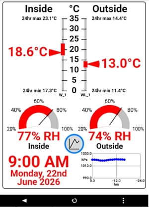

# pfodParser
The pfodParser library serves user interfaces and handles user commands sent from 
[pfodWeb](https://www.forward.com.au/pfod/pfodWeb/index.html)
and the
[Android pfodApp](https://www.forward.com.au/pfod/index.html).  

  

pfodWeb.html (included in this library) displays your GUI and runs in your off-line brower. The entire GUI is completely controlled by your micro's sketch.  
  pfodWeb.html connects to any Arduino or other micro board via Serial.
It can also connect via BLE, TCP/IP Socket or HTTP. _Serial, BLE and TCP/IP connect via pfodProxy_.  
See [pfodWeb Installation and Tutorials](https://www.forward.com.au/pfod/pfodWeb/index.html) 
and the **pfodParser/examples/pfodWeb** Arduino examples in this library.

pfodWeb.html also include a Designer that lets you create your own menus, sub-menus, charts, etc and then generate the complete Arduino code to compiles and upload.  
See [pfodDesignerV3 tutorials and examples](https://www.forward.com.au/pfod/pfodDesigner/index.html).  
The free [Android pfodDesignerV3](https://play.google.com/store/apps/details?id=au.com.forward.pfodDesignerV2) app, which Designer re-implements, currently covers more boards,
 but pfodWeb's Designer coverage will be expanded as time goes on.

The [pfodApp Android client](https://play.google.com/store/apps/details?id=au.com.forward.pfodApp) supports WiFi, BLE, Bluetooth and SMS connections.   
 

For non-Arduino based micros there is a trivial [pfodParserC](https://www.forward.com.au/pfod/pfodParserLibraries/pfodParserC.html)
which compiles to <2K on an ATtiny84, including the software serial implemenation,
and much less on micros with UART support. This trivial C pfodParser lets you use **pfodWeb** on any brower to control, monitor and chart and capture data from
any micro via Serial. 
(see [pfodParser for Non-Arduino microprocessors](https://www.forward.com.au/pfod/PIC/index.html)

This library includes:-  
* **pfodParser**, parses pfod commands and serves the GUI 
* **pfodWeb**, browser version of pfodApp that connects via Serial, BLE, TCP/IP or HTTP to display interactive GUI's   
* **pfodSecurity**, alternative to pfodParser that adds 128bit sercuity   
* **pfodDwgs**, classes for sending dwg commands to create interactive GUI's 

# Quick Start

* Compile and upload the _**examples → pfodParser → pfodWeb → demoScreens_Serial**_ example sketch to your UNO or higher board
* Open .../Arduino/libraries/pfodParser/pfodWeb/pfodWeb.html in your browser and follow the pfodProxy Instructions to install the pfodProxy for your OS
* Select the COM port for your board and Connect to display a demo of various pfod menu items, sub-menus, dwgs and charts.

# pfodWeb
The pfodWeb sub-directory contains the single page pfodWeb.html client that runs in all browsers since 2017.
No local server is required. You can run pfodWeb on a completely isolated network with no internet access.  
pfodWeb can also be served directly from your micro for a completely self-contained deployment. See the **pfodParser/examples/pfodWeb/demoScreens_http** Arduino example.  

For the Designer/Code Generator and HTTP connections, no additional downloads are required. For Serial, BLE and TCP/IP connection
 download the pfodProxy (windows,macOS or linux).  See [pfodWeb_startup.html](https://www.forward.com.au/pfod/pfodWeb/pfodWeb_startup.html).

The **pfodWeb/data** sub-directory contains pfodWeb as .gz files suitable for serving from your microprocessor for a completely self-contained deployment.   
The **pfodWeb/docs** sub-directory contains the docs for pfodWeb.

pfodWeb is open-source. The source is available from [pfodWeb_src.zip](https://www.forward.com.au/pfod/pfodWeb/pfodWeb_src.zip) 
and github hosted at [pfodWeb_src](https://github.com/drmpf/pfodWeb_src) 

# How-To
See [pfodWeb Installation and Tutorials](https://www.forward.com.au/pfod/pfodWeb/index.html)  
See [pfodParser Examples](https://www.forward.com.au/pfod/index.html)  
See [pfodDesignerV3 tutorials and examples](https://www.forward.com.au/pfod/pfodDesigner/index.html)  
See [pfodParser Documentation](https://www.forward.com.au/pfod/pfodParserLibraries/index.html)  

# Software License
(c)2014-2026 Forward Computing and Control Pty. Ltd.  
NSW Australia, www.forward.com.au  
This code is not warranted to be fit for any purpose. You may only use it at your own risk.  
This code may be freely used for both private and commercial use  
Provide this copyright is maintained. See pfodWeb/docs/pfodWeb_pfodProxy_License.html for the inherited licenses. 

# Revisions 
Version 5.1.0 pfodWeb V4.1.0  
Version 5.0.3 Added mouser over data display to charts  
Version 5.0.2 Revised pfodProxy connection  
Version 5.0.1 Complete pfodWeb V4.0.0 and bug fixed located by claude  
Version 5.0.0 Almost complete pfodWeb  
Version 4.1.2 Updated data sub-dir  
Version 4.1.1 Added images to documentation  
Version 4.1.0 Revised HTTP connection support for pfodWeb, ESP_Pico_pfodWebServer  
Version 4.0.0 Added Charting support to pfodWeb  
Version 3.66.6 Updated pfodWeb examples  
Version 3.66.5 Added cache control setting for pfodWeb http. Updated data subdir. Now needs 1M FS space   
Version 3.66.4 Fixed pfodWeb value display and added basic charting to pfodWeb
Version 3.66.3 Fixed scaling of nested drawings.  
Version 3.66.2 Fixed display of nested drawings.      
Version 3.66.1 Added support for pfodWeb to connect Serial and BLE connection.    
Version 3.65.1 revised pfodWeb examples and serving of pfodWeb files. Added support for Serial and BLE connection  
Version 3.64.1 Breaking Change. pfodDrawing sub-classes now need to call init() to complete initialization and to add them to the pfodParser linked list. Added source files .html / .js for pfodWeb  
Version 3.64.0 added pfodWeb support for Pi PicoW/2W, ESP32 and ESP8266, added pfodDebugPtr, pfodESPBufferedClient now supports Pi Pico W/2W  
Version 3.63.11 pfodESPBufferedClient now also supports Pi Pico W / 2W  
Version 3.63.10 added clear() method to pfodStreamString for Pi PicoW  
Version 3.63.9 added JSON escaping of control chars in the range 0x00 to 0x1F  
Version 3.63.8 fix newline fitering in pfodStreamString add JSON escapes  
Version 3.63.7 added newline fitering to pfodStreamString  
Version 3.63.6 added DOWN_DRAG_UP alias for DOWN_UP  
Version 3.63.5 added pfodStreamString  
Version 3.63.4 corrected empty cmd test  
Version 3.63.3 added specification to docs (mainly for AI reference)  
Version 3.63.2 added parse timeout  
Version 3.63.1 added multiple connections support  
Version 3.62 added default initializations  
Version 3.61 added linked list for processing dwg cmds, added pfodESPBufferedClient, fixed label/touchActionInput encoding  
Version 3.60 revised arguments to support pfodSecurity  
For earlier revisions see the [pfodParser LibraryVersion.txt file](https://www.forward.com.au/pfod/pfodParserLibraries/LibraryVersion.txt)  
